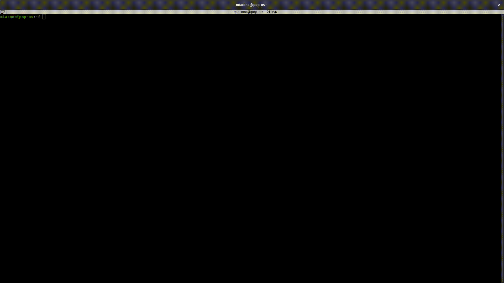
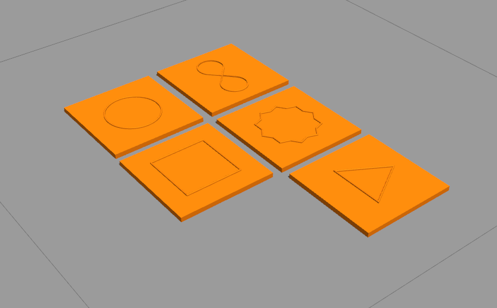
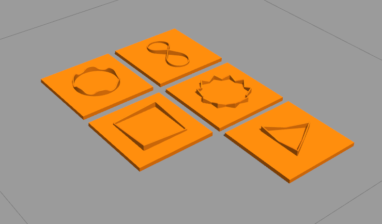
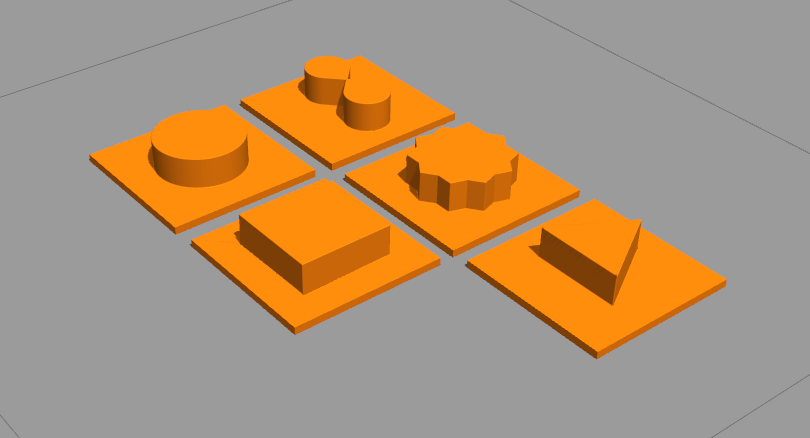

Contour following with iCub
======================

Contour following poses no challenge to us as humans as we do it instinctively with no effort. But in robotics, it requires a lot of effort. On the one hand, the input has to be processed in a meaningful way, on the other hand, motor control has to be executed according to such input. This close loop between sensory read-out and action control is still troublesome especially when it relies on tactile information only.
To tackle this we have designed a contour following task in different stages of complexity starting from continuous 2d structures to challenging 3d structures. The humanoid robot [iCub](https://www.iit.it/web/icub) implemented in the simulation environment [gazebo](http://gazebosim.org/) and equipped with [tactile sensors](http://wiki.icub.org/wiki/Tactile_sensors_(aka_Skin)) in the fingertip and palm serves as our object of research. More about the sensors, there placing and implementation you can find [here](https://github.com/2103simon/icub_haptic_exploration_environment). The simulation environment can be easily accessed using [docker](https://www.docker.com/). For that, we have prepared a ready-to-use [docker image](https://hub.docker.com/repository/docker/2103simon/contour_following).

# Getting started

### What is Docker?

Docker provides a simple and effective way to share and maintain your development environment. Unlike virtual machines the Docker containers share the kernel with the host, but runs processes isolated from the rest of the system using the files contained in the image. The image is built using a Dockerfile, which is a set of instructions that define the base image (i.e. `ubuntu:bionic`), and eventual additional packages to be installed, environment variables to be set, config files to be modified, etc.

### Nomenclature

* **Image**: archive containing all the necessary files to run your containers. Multiple containers can be run from the same image.
* **Container**: active instance of an image. This is where you can run your applications and do your work.
* **Dockerfile**: file containing all the instructions to build your image.
* **Build**: process of creation of the image starting from a Dockerfile.
* **Run**: process of creation of a container which runs on top of an image.

### Docker installation

Please follow the instructions at this [link](https://docs.docker.com/engine/install/) to install Docker on your computer. We recommend using a linux distribution of your choice. Also it is advisable to have a computer equipped with a Intel/Nvidia GPU to run the simulator.

To obtain NVIDIA support within the container, you must first install the `nvidia-container-runtime` following the instruction at this [link](https://github.com/NVIDIA/nvidia-container-runtime).

In order to run docker commands without sudo, once the installation is complete you can run the following command 

```bash
sudo usermod -aG docker $USER
```

as explained [here](https://docs.docker.com/engine/install/linux-postinstall/). For this change to take place you will have to logout and back in. This can easily achieved rebooting your computer. To test your installation you should now be able to run 

```bash
docker run hello-world
```

 ## Useful commands 

  * `docker run -it --name <CONTAINER_NAME> <IMAGE_NAME>` to run a container in interactive mode.
  * `docker ps -a` to obtain the list of your containers.
  * `docker images` to obtain the list of your images.
  * `docker exec -it <CONTAINER_NAME> bash` to run a bash inside a container.
  * `docker build [OPTIONS] PATH | URL | -` to build Docker images from a Dockerfile. 
  * `docker rmi <IMAGE_NAME>`to remove an image. **NOTE**: all containers and images based on the image to remove must be removed first. 
  * `docker start <CONTAINER_NAME>`to start a container.
  * `docker stop <CONTAINER_NAME>`to stop a container.
  * `docker rm <CONTAINER_NAME>`to remove a container. **NOTE**: container must be stopped first.
  
### Running the image on Linux

After the installation you can run the image using the following command:

```bash
docker run -it --name contour_following \
           -v /tmp/.X11-unix/:/tmp/.X11-unix \
           -e DISPLAY=unix$DISPLAY \
           2103simon/contour_following:latest
```

If you want to use the primary graphic card on your system, typically Intel, within the container run the following:
```bash
docker run -it --name contour_following \
            -v /tmp/.X11-unix/:/tmp/.X11-unix \
            -e DISPLAY=$DISPLAY \
            -v /dev/dri:/dev/dri \
            2103simon/contour_following:latest 
```

To use NVIDIA GPU specifically, please use instead:

```bash
docker run -it --name contour_following \
           -v /tmp/.X11-unix/:/tmp/.X11-unix \
           -e DISPLAY=unix$DISPLAY \
           -v /dev/:/dev \
           --runtime=nvidia \
           -e NVIDIA_DRIVER_CAPABILITIES=graphics \
           2103simon/contour_following:latest
```

For further information about the meaning of each option please refer to the official documentation at this [link](https://docs.docker.com/engine/reference/run/).

Once you run the container you will enter a bash in a system which is isolated from the rest of your machine. In there you will find the typical linux file system, and all the dependencies, libraries, which will be used during the workshop already installed for you. 

The above commands also enable screen forwarding. For it to properly work you need to authorize docker to run GUI on the XServer running the following command on your host machine (outside the container):

```bash
xhost local:docker
```
This command needs to be run on every reboot. To avoid that and permanently authorize docker you can add the following lines to the `/etc/profile` file:

```bash
if [ "$DISPLAY" != "" ]
then
 xhost local:docker
fi
```

After closing the terminals, you can always access a previously run container with:
```bash
docker start contour_following
docker exec -it contour_following bash
```

To avoid typing long and hard to memorize commands we have provided a simple set of commands that you can source from your `~/.bashrc`. To do it download the file available in this repo at `docker/bashrc_docker` then add the following lines to your bashrc:

```bash
PATH_TO_CODE=/path/to/code
PATH_TO_DATA=/path/to/data
PATH_TO_APP=/path/to/app
source /path/to/bashrc_docker
```
where you need to specify the path to the `bashrc_docker` file you just downloaded and, optionally but strongly recommended, the path to where you keep your code, your data and your applications. These three directories will be shared with the running container so that you can work on the code that is stored in your host machine (and not risk to lose your work), get the data you need to run the code, and eventually run some applications (i.e. IDEs) from within your container. You will find them inside the container at `/data`, `/code`, `/apps`.

After restarting the bash, you will have available on your command line three functions with auto-complete support:

* `run_docker <IMAGE_NAME> <CONTAINER_NAME> [ADDITIONAL OPTIONS]`
Runs an image into a specified container with X server forwarding for running GUIs, and binds three directories from your host system as specified above.
* `run_docker_opengl <IMAGE_NAME> <CONTAINER_NAME> [ADDITIONAL OPTIONS]`
Adds the Nvidia and OpenGL specific options to `run_docker`.
* `start_docker <CONTAINER_NAME>`
Starts and executes a bash on the specified container (must be run first).

if you have "_completion_loader: command not found" error, then make sure (or add otherwise) that the command line "source /etc/profile.d/bash_completion.sh" appears uncommented before the source of the .basrch_docker file inside the .bashrc.

### Using the container

The whole infrastructure we will be using for this task depends on the [YARP](https://www.yarp.it/git-master/) middleware (already installed in the container). The latter puts in communication several modules potentially spanned across several machines onto the same network. The modules communicate via ports that, once connected, will stream information through a server which must run in the background all the time. Please refer to [link](https://www.yarp.it/git-master/tutorials.html) for a series of tutorials on how to implement such communication. You will also find similar snippets in the starting code available in this repo. 

In order to get everything started you must then run the container, start a yarpserver and from a separate terminal open another bash inside the container and run the yarpmanager. The latter is a graphical tool that allows to start and connect multiple modules with one click. We have already prepared an application called iCub_Contour_following that launches the simulator, a logger and a motor GUI which allows to see the status and move the joints of the robot in simulation. See GIF below to get an idea of this pipeline.


To start the development we recommend to keep this repository stored in your code directory (see section above for description of the folder convention) and open it with your favorite IDE. There are several methods to allow the development inside the container. In the next GIF we demonstrate how to launch CLion from within the container, providing it access to the all files and libraries stored and installed in it.  



Another option would be to use the docker integration plugin available for visual studio code. You can find instructions on how to use it at this [link](https://code.visualstudio.com/docs/remote/containers).

The starting code in `contour_following.cpp` we provide already contains the necessary to connect to the robot, move it to a starting position and read in a loop the tactile sensor readout. There are markers in the file that will tell you where you will have to add your contribution.

### Task

The robot will always start at the top right corner of the objects with no contact with the contours. Your task is to give iCub the ability to follow the different contours, first in 2d. Following the circle for instance will be the easiest task as it is continuous and has no abrupt changes. The triangle otherwise includes very sharp edges and the robot needs to adapt its movement fast and correctly to keep track. At least we have included an object with crossing contours to test your solutions on sustainability.

For those who master the first challange we have inlcuded the 3d objects. Now it is not sufficient to rely on the spacial component (e.g. which sensor measures the force), but the amount of force gets an important feature to keep contact. Here again the difficulty is wide spread from continues, wavelike structures to some with sharp edges and crossing contours. The 3d objects are similar to the 2d with just adding depth dependencies on top. 


2d objects | 2.5d objects | 3d objects
:---------:|:------------:|:----------:
  |   |  


If you are able to solve all of the given tasks we are still able to provide you even more challanging ones. The content of that can be discussed in the regular meetings.

Good luck and have fun
