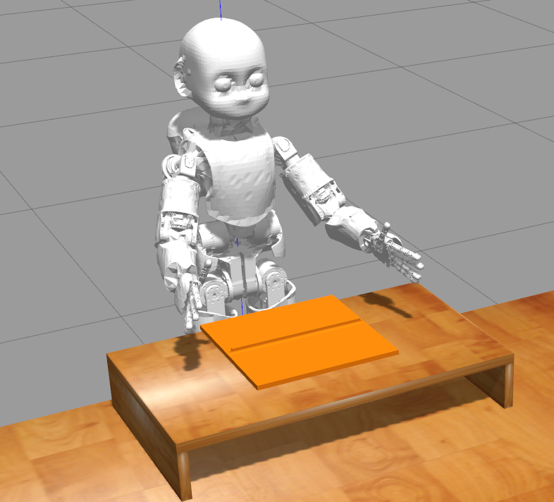
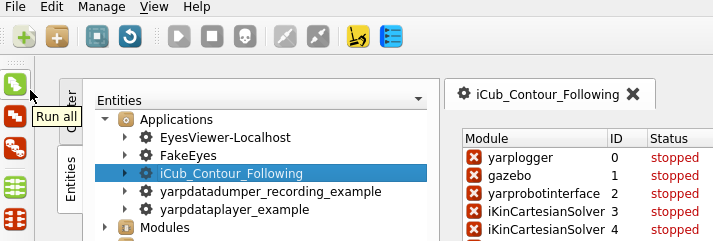
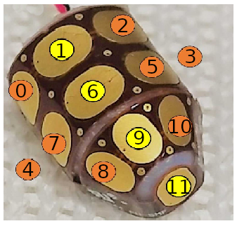
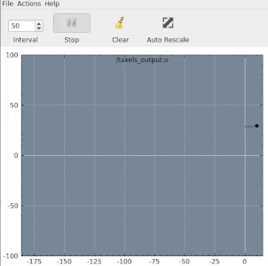

<p align="center">
  
</p>

<p align="center">
    <h1 align="center">
        NeuTouch Summer School 2021<br>
        Contour following with iCub
    </h1>
</p>

In this exercise, we challenge you to design a controller to **follow a contour using the right index fingertip** of the [iCub humanoid robot](https://icub.iit.it) in simulation. The adopted platform is [Gazebo](http://gazebosim.org/) where both the robot and **suitable tactile sensors** are simulated. We provide a full environment to execute the exercise via a Docker image.

<p align="center"></p>

### Summary
- [How to install the software](#how-to-install-the-software)
- [How to start the simulation environment](#how-to-start-the-simulation-environment)
- [How to code and build the controller](#how-to-code-and-build-the-controller)
- [Useful tips](#useful-tips)


### How to install the software
<details>
<summary>Click to open</summary>

1. Clone this repository:
    ```console
    git clone https://github.com/event-driven-robotics/neutouch_summer_school_contour.git
    ```
1. Pull the docker image:
    ```console
    docker pull 2103simon/contour_following:latest
    ```
1. Create a docker container (using an NVIDIA GPU):
    ```console
    cd neutouch_summer_school_contour
    xhost +
    docker run -it --name contour_following \
               -e DISPLAY=$DISPLAY \
               -v /dev/dri:/dev/dri \
               -v $PWD:/neutouch_summer_school_contour \
               -v /tmp/.X11-unix:/tmp/.X11-unix \
               --runtime=nvidia \
               -e NVIDIA_DRIVER_CAPABILITIES=graphics \
               2103simon/contour_following:latest
    ```
    > Note: it is important to `cd` inside the cloned repository `neutouch_summer_school_contour`in order to create the container succesfully using the command above (otherwise `$PWD` will not contain the correct path.)

Should you need to attach to the container you have created at any time, you can always use (**this comes in handy if you need to open more the one terminal inside the container**):
```console
docker exec -it contour_following bash
```

If for any reason the container is not running (you will receive an error in such case), it can be started again using:
```console
docker start contour_following
```
</details>

### How to start the simulation environment
<details>
<summary>Click to open</summary>

1. Open one terminal **inside the container** and run the YARP server using `yarpserver --write`
1. Open a second terminal **inside the container** and run the YARP manager using `yarpmanager`:
   1. Select the application `iCub_Contour_following`
   1. Press on the green button `Run all`
   <p align="center"></p>
   1. After some seconds, you should see the following environment:
   <p align="center"></p>

Should you need to stop the environment, you can use the red button `Stop all`. If `gazebo` does not close after a while, you can kill it using `killall -9 gzserver gzclient` (even outside the docker container).

#### How to Change the contour

We provide several contours you can use in the exercise. They can be listed [here](https://github.com/2103simon/icub_haptic_exploration_environment/tree/master/environment/models/contour_following). To change the contour please proceed as follows:

1. Visualize the contour to see its shape by opening in your browser the .STL mesh file. E.g. for the shape `circle_2_5d` try to visualize [circle_2_5d.stl](https://github.com/2103simon/icub_haptic_exploration_environment/blob/master/environment/models/contour_following/cf_circle_2_5d/circle_2_5d.stl)

1. Stop the simulation if running

1. Run the following from within the container:
```console
   cd /usr/local/src/icub_haptic_exploration_environment/build
   gedit ../environment/worlds/he_scenario.sdf
```
1. Change line `40` to `model://cf_<name>` where `<name>` is e.g. `circle_2_5d`

1. Change line `51` to `to_be_followed::<name>::<name>_root_link`

1. Save and close `gedit`

1. Run `make install`

After that, you can restart the simulation environment and play with the new shape.
</details>

### How to code and build the controller

<details><summary>Click to open</summary>

We provide a starting point for you in the C++ file [contour_following.cpp](contour_following.cpp). The code will initialize the [iCub Cartesian controller](https://robotology.github.io/robotology-documentation/doc/html/icub_cartesian_interface.html) that you can use to send 6D pose *(or velocity)* references (both Cartesian position and orientation) to the right index fingertip.

**You can edit the source file locally from your OS using your favourite editor as the repository has been cloned outside the docker container.** In order to build the code, instead, you should act within the container as follows.

Open a terminal **inside the container** and run:

```console
cd /neutouch_summer_school_contour
mkdir build
cd build
cmake ../
make
```

- The resulting executable `contour_following` can be run using `./contour_following`. Please first run the simulation environment, otherwise the executable will not be able to connect to the robot.
- The module will first close all the fingers, except the right index, and then will move the right hand to an initial pose. After that, the code within `ContourFollowingModule::updateModule()` will be executed periodically.

</details>

### Useful tips

<details><summary>Click to open</summary>

#### Code structure

<details>
<summary>Click to open</summary>

The code is implemented as a standalone class `ContourFollowingModule`:

-  The module gets configured within the method `ContourFollowingModule::configure()`.

-  A periodic method is called automatically every `ContourFollowingModule::getPeriod()` seconds, namely `ContourFollowingModule::updateModule()`. This is the place where you can add your code.

> Bear in mind that the method is called periodically and goes out of scope at the end of each run. Should you need to store any data outside of the scope of a single method update, you will need to store it in a **class member variable**.

</details>

#### Sensors input

<details>
<summary>Click to open</summary>

Sensors simulate the behavior of the iCub humanoid robot tactile sensors that are present on the fingertips. Each fingertip is equipped with 12 taxels that provide a measure of the pressure exerted on them.

- Each taxel is associated with an ID as follows:

<p align="center"></p>

- You can visualize the pressure of the taxel with id `<ID>` as follows if the `contour_following` module is running. From **within the docker** run:
  ```console
   yarpscope --remote /taxels_output:o --index <ID>
  ```
  <p align="center"></p>


- You can access to the pressure of each taxel as follows:

  ```
  ...
  // This is an excerpt of the contour_following.cpp file
  ...
  bool updateModule()
  {
      iCub::skinDynLib::skinContactList *input = skinEventsPort.read(false);

      if (input != nullptr)
      {
        // input is a std::vector of iCub::skinDynLib::skinContact contacts
        for (const iCub::skinDynLib::skinContact& skin_contact : *input)
        {
          // Each contact might contain several taxels activations
          // However, in the current implementation a contact always contains a single taxel

          // To get the the ID of the taxel use
          const int taxel_id = skin_contact.getTaxelList()[0];

          // To get the pressure associated to it use
          const double pressure = skin_contact.getPressure();
        }
      }
  }
  ```

</details>

#### Robot control

<details>
<summary>Click to open</summary>

In order to move the fingertip of the right index finger of the robot, you will be using the iCub Cartesian Interface ([high level description](https://robotology.github.io/robotology-documentation/doc/html/icub_cartesian_interface.html) [API](https://www.yarp.it/latest/classyarp_1_1dev_1_1ICartesianControl.html)).

The controller is accessible within the `ContourFollowingModule::updateModule()` using the class member variable `cartControl` of type `ICartesianControl*`.
- the responsiveness of the controller (i.e. how fast it will react to the references you sent) is decided using the method `setTrajTime()`. The smaller the trajectory time, the faster the response. The default trajectory time for the exercise is decided within `ContourFollowingModule::configure()`

```
bool configure(ResourceFinder &rf)
{
  ...
  cartControl->setTrajTime(1.0);
  ...
}
```
- the reference frame that is commanded by the controller is usually the iCub hand palm (check the figure [here](https://icub-tech-iit.github.io/documentation/icub_kinematics/icub-forward-kinematics/img/RightHandCADRefFrame.jpg)). For your convenience, we moved the reference frame to the right index fingertip, so that you can command its pose directly. **Bear in mind that the frame orientation has not been changed instead.**

Useful methods we suggest to check out on the [API](https://www.yarp.it/latest/classyarp_1_1dev_1_1ICartesianControl.html) are :
- [goToPoseSync](https://www.yarp.it/latest/classyarp_1_1dev_1_1ICartesianControl.html#a3e6d8ff73db8798b89ff41fb0326771d) which moves the end-effector to a given 6D pose (and does not return until the motion is completed)
- [goToPose](https://www.yarp.it/latest/classyarp_1_1dev_1_1ICartesianControl.html#a069f1792bb8b45f521cb4fa9d9abc406) same as above, but does not wait (useful for streaming commands to the controller)

Commands `goToPose[Sync]` require, **as second argument**, the orientation of the frame as a 4-dimensional `yarp::sig::Vector` vector containing the axis/angle representation of the rotation. We provided a suitable configuration for the orientation in the variable `orientation_0` (a class member variable) so that you can focus on deciding the position of the fingertip.

</details>

</details>
